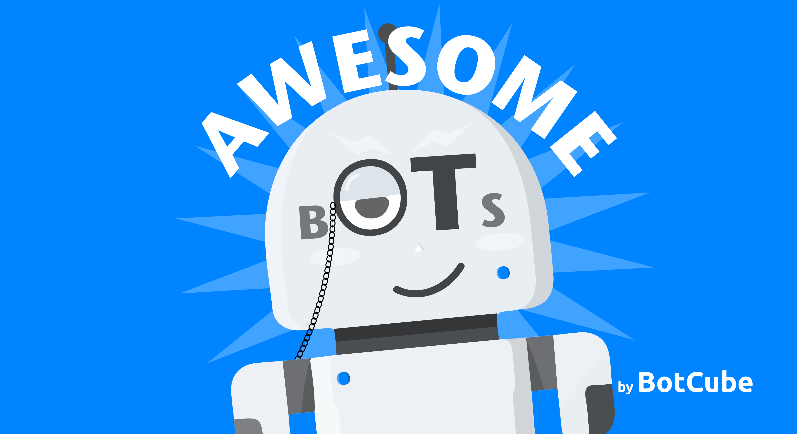

# Awesome bots  

> Please read the [contribution guidelines](contributing.md) or the [creating a list guide](create-list.md) if you want to contribute.

### We also run one of the most active Facebook communities (1100+ members) and Telegram channel (1,700+ members) about voice assistants.

You can request access here:

1. Facebook group: https://www.facebook.com/groups/storylinecommunity

2. Telegram channel (hot industry news & insights): https://t.me/botcube

## Table of Contents
- [Voice bots](#voice-bots)
- [Newsletters](#newsletters)
- [Podcasts and episodes](#podcasts-and-episodes)
- [Popular examples of bots](#popular-examples-of-bots)
- [Directories (lists)](#directories-lists)
- [Messaging platforms](#messaging-platforms)
- [Tools](#tools)
  - [Analytics](#analytics)
  - [Marketing](#marketing)
  - [Monetization](#monetization)
  - [Prototyping](#prototyping)
  - [Testing](#testing)
  - [Internationalization](#internationalization)
  - [Customer Service](#customer-service)
- [Sources (news, articles, blogs, resources)](#sources-news-articles-blogs-resources)
  - [VentureBeat](#venturebeat)
  - [TechCrunch](#techcrunch)
  - [Medium](#medium)
  - [Reddit](#reddit)
  - [Other](#other)
- [Job boards](#job-boards)
- [NLP (tools, engines, SDKs, frameworks)](#nlp-tools-engines-sdks-frameworks)
- [Bot building platforms](#bot-building-platforms)
- [Personal assistants](#personal-assistants)
- [Payment & subscription services](#payment--subscription-services)
- [ChatOps](#chatops)
- [Bot Development](#bot-development)
  - [SDKs/Frameworks/Libraries](#sdksframeworkslibraries)
  - [Boilerplates/templates](#boilerplatestemplates)
  - [Tutorials/guides](#tutorialsguides)
- [Agencies](#agencies)
- [Influencers/People](#influencerspeople)
- [Events](#eventsconferencesmeetups)
- [Fundraising (accelerators, camps, capitals, funds)](#fundraising-accelerators-camps-capitals-funds)
- [Books](#books)
- [Communities/chats](#communitieschats)
- [Video Tutorials](#video-tutorials)

## Contents

### Voice bots
* [Storyline](https://getstoryline.com) - Create voice apps without coding via visual interface and ready-to-use templates.
* [BotTalk](https://bottalk.de) - Create voice apps for Amazon Alexa and Google Assistant with simple Yaml Markup.

### Newsletters
* [How Bot Industry Grow By Up To 100% Month Over Month](https://botcube.co/newsletter) - Five epic actionable bot tricks delivered to your email once a week
* [Bot Weekly](http://botweekly.com/) - Bot Weekly is a weekly round up of the most interesting chatbot and AI news
* [Chat Bots Weekly](http://www.chatbotsweekly.com/) - 4100+ people from companies like Slack, Facebook, PH, Kik and Sequoia are here. Covering the industry around Slack, SMS, Kik and Facebook Messenger chatbots. Also called conversational commerce or #ConvComm
* [Botlist Weekly](http://botlist.us12.list-manage1.com/subscribe?u=b9348305a16bf754c64f822a7&id=71c583935e) - Weekly newsletter from BotList
* [The Messenger](http://orat.us3.list-manage.com/subscribe?u=bc7bf59bacb552868cc103361&id=e906a9ad0a) - A personally curated selection- featuring mobile messengers, chatbots and industry experts
* [Bot! zine](https://botzine.org/) - An online newsletter for #botmakers and bot enthusiasts. Bots, chat bots, art bots, NLP, chat interfaces, machine learning, AI, latest tutorials and resources, interviews and upcoming events
* [Topbots](http://www.topbots.com/) - Make sure you're in-the-know about important news, breakthroughs, and applications of artificial intelligence and bots. TOPBOTS is your ultimate guide to exponential technologies
* [Chatbots weekly digest](http://www.chatbotsdigest.com/) - The Web's best digest on Chatbots & AI, by https://www.botfuel.io
* [BotBeat](http://venturebeat.com/newsletters/) - VentureBeat Newsletters. Connecting the dots: AI, messaging and bots
* [Hearing Voices](https://www.getrevue.co/profile/hearingvoices) - This week's news about voice computing apps, delivered directly to your inbox
* [Alexa News](https://developer.amazon.com/alexa-skills-kit/alexa-developer-newsletter-subscription) - Provide your email address to stay up to date with the latest Amazon Alexa news and IoT and voice industry trends
* [Messaging Weekly](http://www.messagingweekly.com/) - The week's best messaging and #convcomm news, opinions and apps delivered every Friday
* [Technically Sentient](https://inside.com/technically-sentient) - Bringing you the latest in Artificial Intelligence, Robotics, and Neurotechnology
* [Locutius](http://tinyletter.com/locutius) - Locutius starts your week with with everything you need to know about the design and business of conversational systems, from voice to chatbots, plus the machine intelligence that powers it all
* [UX for Bots](http://tumblr.us10.list-manage.com/subscribe?u=abc28827ca1442d42b7900c42&id=581301db03) - A monthly recap of the best content shared on the UX for Bots Facebook group in your inbox
* [Chatbots weekly digest](http://www.chatbotsdigest.com/) - A weekly digest of chatbot and AI related news

### Podcasts and episodes
* [O'Reilly Bots Podcast](https://www.oreilly.com/topics/oreilly-bots-podcast) - The O'Reilly Bots Podcast covers advances in conversational user interfaces, artificial intelligence, and messaging that are revolutionizing the way we interact with software
* [BotCast from oratio / Swell](https://botcast.wtf/) - Weekly insights from the bots and messaging space with Pete & David
* [Bots Podcast with Jon Bruner](https://dev.to/sedaily/bots-podcast-with-jon-bruner)
* [VZV Podcast](http://www.verizonventures.com/blog/podcast/episode-1-chatbots-and-ai/) - Chatbots and AI podcast, hosted by Christie Pitts of the Verizon Ventures Development Team
* [a16z Podcast: Bots and Beyond](http://a16z.com/2016/04/18/bots-messaging-conversation-commerce/) - Connie Chan, Benedict Evans, and Chris Messina discuss the topic of bots, mobile, and beyond: the (evolution?) from web to apps to messaging to bots; chat as an interface; “conversational commerce”; and so on
* [Software Engineering Daily](https://softwareengineeringdaily.com/tag/chatbots/) - Weekly podcasts about chatbots and messaging, including Slack Bots Podcast with Amir Shevat
* [LPX Episode 7: Are chatbots the new apps?](https://lpxshow.com/lpx-episode-7-are-chatbots-the-new-apps/) - A podcast about future of chatbots with Robert Stephens, a co-founder of a new chatbot service called Assist.
* [What's Tech](http://www.theverge.com/2016/4/19/11459188/what-are-bots-explainer-faq-guide-facebook-microsoft-) - Casey Newton from The Verge on the interesting applications of bots

### Popular examples of bots
* [Poncho](https://poncho.is/) - Poncho delivers customizable weather forecasts daily via email and text message, helping you plan everything from your commute to your outfit. It's free!
* [Swelly](https://www.messenger.com/t/swell.bot/) - Bot to provide the fastest way of asking questions and getting opinions by friends!
* [Instalocate](https://m.me/instalocate) - Instalocate is a real-time flight tracking bot. You can get flight status, delay alerts, arrival, departure, and gate information
* [Kayak](https://www.messenger.com/t/90811893045/) - The bot lets users find flights and hotels using conversational language rather than the old-school method of plugging in dates and sifting through hundreds of results
* [TheScore](https://www.messenger.com/t/theScore/) - theScore brings you real-time sports scores and news from the teams you care about, with deep coverage of MLB, NBA, NFL, NHL and major soccer leagues!
* [Foxsy](https://www.messenger.com/t/515669261955683/) - Foxsy is your personal matchmaking assistant to find a beautiful and meaningful connection with the right person. And, Foxsy is the first and the best matchmaking Chatbot in the world
* [PayPal](https://chatbottle.co/bots/paypal-for-slack) - With PayPal bot you can pay your friends and teammates on Slack and on your preferred device
* [Skyscanner](https://join.skype.com/bot/57bfbc6f-1556-46fc-b4fa-41ea57b26df6) - Skyscanner bot for Skype is a passenger flight search engine that allows users to browse for flights via price and location
* [Visabot](https://www.messenger.com/t/visabot/) - Visabot for Facebook Messenger is an immigration attorney 2.0 Inspired by U.S. top immigration lawyers to deliver the results no lawyer can match
* [Hipmunk](https://www.messenger.com/t/hipmunk/) - Hipmunk chatbot for Facebook Messenger is a super-powered Hipmunk who digs through tons of travel options to help you find the best flights and hotels
* [Mica, the Hipster Cat Bot](https://hipstercatbot.com) - Mica, the Hipster Cat Bot is a venue recommendation bot that helps you discover the best places worldwide - on FB Messenger, Skype, Kik, Telegram
* [Nikabot](https://www.nikabot.com) - A Slack bot that keeps track of what your team is doing so you don't have to 

### Directories (lists)
* [ChatBottle](https://chatbottle.co/) - Chatbots Search Engine
* [There is a bot for that](https://thereisabotforthat.com/) - Search engine for bots
* [BotList](https://botlist.co/) - App Store for bots
* [Microsoft Bot Directory](https://bots.botframework.com/) - Bot Directory from Microsoft
* [Slack bot directory](https://slack.com/apps)
* [Intento](https://inten.to/) - Search platform for FB Messenger/Telegram/Viber
* [Telegram Bots Store](https://storebot.me/)
* [Botpages](https://www.botpages.com/) - Botpages help make it easier for you to discover and find bots
* [ProductHunt bot directory](https://www.producthunt.com/topics/bots)
* [TeamChat botstore](http://www.teamchat.com/en/bot-store/)
* [Qwazou Bot](https://www.messenger.com/t/Qwazou) - A Messenger Bot that helps you discover new bots on Messenger.

### Messaging platforms
* [Facebook Messenger](https://developers.facebook.com/docs/messenger-platform)
* [WeChat](https://admin.wechat.com/)
* [Skype](https://www.skype.com/en/developer/)
* [Telegram](https://core.telegram.org/)
* [Kik](https://dev.kik.com/#/home)
* [Twitter](https://dev.twitter.com/overview/api)
* [LINE](https://developers.line.me/messaging-api/overview)
* [VKontakte](https://vk.com/dev/bizmessages)
* [iMessage](https://developer.apple.com/imessage/)
* [Viber](https://developers.viber.com/)
* [HipChat](https://www.hipchat.com/docs/apiv2)
* [Skype for Business](https://dev.office.com/Skype)
* [Cisco Spark](https://developer.ciscospark.com/getting-started.html)
* [Slack](https://api.slack.com/bot-users)
* [Smooch](https://smooch.io/)
* [Discord](https://discordapp.com/developers/docs/intro)
* [Amazon Alexa](https://developer.amazon.com/alexa)
* [Google Home/Google Assistant](https://developers.google.com/actions/)
* Web
  * [Smooch](https://smooch.io/)
* SMS
  * [Twilio](https://www.twilio.com/sms)
  * [Sinch](https://www.sinch.com/products/sms-api/)
* Email

### Tools

#### Analytics
* [Botimize](http://www.botimize.io/) - Optimize your bot for happier customers, scientifically. Track, test, and action in real time. It's as easy as 1 - 2 - 3
* [BotMetrics](https://bot-metrics.com/) - Bot & Conversation Analytics
* [Dashbot](https://www.dashbot.io/) - Actionable Bot Analytics. Increase user engagement, acquisition, and monetization through actionable bot analytics. Now supporting Alexa and Google Home
* [BotAnalytics](https://botanalytics.co/) - Make decisions with historical & real time conversation data. We combine real time conversations with historical ones to help answer the toughest questions about engaged, churnable and retained conversations
* [Facebook Bot Analytics](https://developers.facebook.com/docs/messenger-platform/product-overview/analytics) - Official Analytics tool for Facebook Messenger Bots
* [ChatUrl](https://charturl.com/) - Easily add rich, data-driven charts to your web & mobile apps, chat bots, and emails. We’ve thought of everything to help you transform your data into chart images with less effort
* [Botlytics](http://www.botlytics.co/) - Analytics for your bot. Track the messages your bot sends and the conversations your bot has
* [UxProbe](https://www.uxpro.be/chatbot-analytics/) - Use UXprobe to measure the most important thing about a chatbot – how often users are successful. See how users complete or fail tasks (intents). Drill into sessions with failed tasks to improve the logic of your chatbot
* [DialogAnalytics](https://dialoganalytics.com/) - Conversational Analytics. Insights into your conversational applications
* [VoiceLabs](http://voicelabs.co/) - Voice analytics for Alexa and Google Assistant, free and live in 10 minutes
* [Opearlo Analytics](https://analytics.opearlo.com/) - Track the usage of your Alexa Voice Apps
* [Witlingo](http://www.witlingo.com/) - Witlingo is a full stack Software as a Service product that enables you to continually learn about your conversations. We provide out-of-the-box Analytics that measure how your conversation is performing for your customers
* [ChatMetrics](https://chatmetrics.io/) - Push-notifications platform for bots
* [Wordhop](https://www.wordhop.io/) - Wordhop enables humans and AI to work together to enhance customer service, drive eCommerce transactions, and keep customers engaged in conversation
* [Dimon](https://dimon.co/) - Dimon enables bot and chatbot owners to identify and fix issues in their bot conversations
* [ChatbotProxy](https://www.chatbotproxy.com/) - Extensible proxy between your chatbot and providers. It helps debug incoming/outgoing requests using `curl`. And it keeps per page metrics for Facebook Messenger bot apps.
* [Botmeter](https://www.botfuel.io/features/botmeter) - Follow performance, optimize conversations and understand your customers' behaviors through our analytics application.
* [Chatbase](https://chatbase.com) - Analyse and optimize bot conversations. Visualize interaction flow, explore chat conversations, analyze retention and track convertions. 

#### Marketing
* [bCRM](https://bcrm.com/) - CRM for Marketers and Customer Support Staff in the chatbot world
* [Hunch](http://hunchinsights.com) - Hunch is your powerful but super simple analytics assistant that constantly monitors your marketing metrics. From answering AARRR  funnel questions to automating your weekly and monthly reporting.
* [Boim](https://bo.im) - Bo.im is gateway to all your channels. It can link to all of your bots, contact info, locations, websites, and much more, while behaving according to where it was clicked on.
* [Messengerify](https://messengerify.me/) - Messengerify will connect the website with your Facebook Page and provide a better chat experience for your customers. Even if visitor leaves your website the conversation can continue via Messenger.
* [WhatsHelp](https://whatshelp.io/) - Messenger Marketing Platform for marketers and entrepreneurs. Grow your subscriber list, create smart bots, and broadcast messages in just a few clicks.

#### Monetization
* [RadBots](https://radbots.com/) - Monetization Tools For Bots
* [waves.ai](https://www.waves.ai/) - Learn, grow & let your goals become reality
* [cashbot.ai](https://cashbot.ai/?fref=gc) - Monetization platform for chat & voice experiences that leverages the rich context of conversation to make relevant, timely product recommendations which lead directly to sales conversions via mobile & traditional E-Commerce.

#### Prototyping
* [BotSociety](https://botsociety.io/) - Design your chatbot. The fastest way to create a bot experience preview
* [BotPreview](https://botpreview.com/) - Easily build previews of chatbot interactions. Sketch chatbot interactions using the BotPreview online editor and share them or export as static HTML or MP4/GIF video, without writing a single line of code!
* [BotMock](https://botmock.com/) - Effortlessly Design Bot Conversations. Build customized bot conversations in under 5 minutes. Share them or export as a gif and video - without writing a single line of code!
* [BotFrame](https://botframe.com) - A playground to design bots
* [Bots UI Kit](http://bots.mockuuups.com/) - Bots UI kit for Messenger Platform
* [Layer Messenger design kit](http://layer.com/messaging-design-kit/) - A design kit for Sketch, containing everything you need to craft beautiful and functional rich messaging experiences
* [Convointerface](https://convointerface.com/) - Build Chatbots, Messaging apps, and Conversational forms with easy to use design assets
* [Walkie](https://walkiebot.co/) - Design your bot dialogue. Test copy, add attachments and share with your dev team. Made for humans, readable by Slack
* [Twinery](https://twinery.org/) - Twine is an open-source tool for telling interactive, nonlinear stories
* [Messenger demo viewer](https://messenger-demo-viewer.kilianvalkhof.com) - Demo your Messenger bot interaction without showing personal chats
* [ChatMapper](http://www.chatmapper.com/) - writing and testing non-linear dialogs
* [Cheap Bots, Done Quick!](http://www.cheapbotsdonequick.com/) - Help you make a Twitterbot! They're easy to make and free to run.
* [BotMockup for Telegram](http://mockuprobot.voltsoft.ru/) - Superfast mockup-tool for Telegram bots! Totaly free. Construct and send messages to the sample bot and make screenshots.

#### Testing
* [BotTesting](http://bottesting.co/) - Test your bot! Send your email and bot link to us, we’ll examine your bot’s performance and usability
* [Dimon](https://dimon.co/) - Dimon enables bot and chatbot owners to identify and fix issues in their bot conversations
* [Chatbottest](http://chatbottest.com/) - ChatbotTest is an open source guide that helps you identify chatbot's design issues under 7 different categories.

#### Monitoring
* [Dimon](https://dimon.co/) - Monitor your production bot with predefined user scenarios

#### Internationalization
* [Cyrano](http://cyrano.unbabel.com/) - Make your bot multilingual. Unbabel's Cyrano API instantly enables your bot to chat in more than 20 languages with human quality
* [Indie Localizers Team](https://www.indielocalization.com) - Release polyglot bots with our human help. We're a team of localizers, developers, testers, and SEOs that can help you add more languages to your bot

#### Customer service
* [LiveChat24/7](https://www.livechat24-7.com/) - Discover how our Chatbot supported Live Chat is the easiest and best way to save time and improve customer service
* [agent.ai](https://www.agent.ai/) - AI-Enhanced Customer Service. Let artificial intelligence resolve your customers’ frequently asked questions in seconds, not days

### Sources (news, articles, blogs, resources)

#### VentureBeat

* [Bots](http://venturebeat.com/category/bots/)
* [Voice Assistants](http://venturebeat.com/search/?q=voice%20assistant)

#### TechCrunch

* [Alexa](https://techcrunch.com/tag/alexa/)
* [Google Home](https://techcrunch.com/tag/google-home/)
* [Bots](https://techcrunch.com/tag/bots/)

#### Medium

* [Alexa](https://medium.com/tag/alexa)
* [Voice Assistant](https://medium.com/tag/voice-assistant)
* [Amazon Echo](https://medium.com/tag/amazon-echo)
* [Google Home](https://medium.com/tag/google-home)
* [Siri](https://medium.com/tag/siri)
* [Voice](https://medium.com/tag/voice)

#### Reddit

* [Alexa](https://www.reddit.com/r/alexa/)
* [Amazon Echo](https://www.reddit.com/r/amazonecho/)
* [Google Home](https://www.reddit.com/r/googlehome/)

#### Other

* [BotCube Telegram channel](https://t.me/botcube) - 🤖 Bots, messaging apps, conversational interfaces, AI & ML — hot reviews & insights from industry experts 🤖
* [Chatbots Magazine](https://chatbotsmagazine.com/) - Chatbots, AI, NLP, Facebook Messenger, Slack, Telegram, and more
* [BotWiki](https://botwiki.org/) - Botwiki is an open catalog of friendly, useful, artistic online bots, and tools and tutorials that can help you make them
* [TopBots](http://www.topbots.com/) - We scour the net for the latest content about bots & artificial intelligence. Be the FIRST to know & understand technical breakthroughs that change how we live and work
* [Chatbot's Life](https://chatbotslife.com/) - Everything you want to know about chatbots
* [ChatbotNewsDaily](https://chatbotnewsdaily.com/) - An Introduction to Chatbots, Messaging Channels and the History of Artificial Intelligence and Robots
* [Bot Stash](http://www.botsfloor.com/botstash/) - A curated directory of chat bot resources & tools
* [Planeta Chatbot](https://planetachatbot.com/?fref=gc) - A chatbot magazine originally created in Spain with the purpose of sharing the latest content about chatbots.
* [UX of Chatbots](http://uxofchatbots.com/) - A curated list of resources to help you on your journey into the User Experience of Chatbots.

### Job boards
* [BotMakers](https://botmakers.net/) - The best place to hire chatbot developers.
* [BotCompass](https://botcompass.co) - 🤖 Chatbot companies and developers to power up your business 🤖
* [Botunity](http://botunity.co/) - Find a job you love in the Bot & AI Industry. Your next opportunity could be with one of these leading companies. Apply today
* [BotJobs](http://botjobs.io/) - A job board focused on the Bot Industry
* [Botified](https://botified.io/) - Hire Quality Bot Developers And Find Bot Jobs
* [ChatbotJobs](https://chatbotjobs.co/) - Find the remote or onsite job related to bots, AI, NLP, machine learning, data, neural networks
* [BotGig](http://www.botgig.com/) - Hire a top-tier development team to build your chatbot
* [BotMakers Projects](https://www.facebook.com/groups/439131813146973) - A Facebook group with Chatbot Development projects curated by BotMakers.

### NLP (tools, engines, SDKs, frameworks)
* [wit.ai](https://wit.ai/) - Natural Language Service for Developers from Facebook
* [api.ai](https://api.ai) - Conversational User Experience Platform from Google. Build brand-unique, natural language interactions for bots, applications, services, and devices.
* [h2o.ai](http://www.h2o.ai/) - H2O.ai is a Visionary in the Gartner Magic Quadrant for Data Science Platforms
* [Amazon Lex](https://aws.amazon.com/lex/) - Conversational interfaces for your applications. Powered by the same deep learning technologies as Alexa
* [Rasa NLU](http://rasa.ai/) - Open-source language understanding for bots. A drop-in replacement for popular NLP tools like wit.ai, api.ai or LUIS
* [LUIS](https://www.luis.ai/) - Language Understanding Intelligent Service (LUIS). LUIS lets your app understand language
* [ChatScript](https://github.com/bwilcox-1234/ChatScript) - Natural Language tool/dialog manager
* [IBM Watson](https://www.ibm.com/watson/developercloud/) - Enable cognitive computing features in your app using IBM Watson's Language, Vision, Speech and Data APIs
* [Botfuel NLP](https://www.botfuel.io/en/features/nlp) - Natural Language Understanding/Processing APIs
* [DeepPavlov](https://deeppavlov.ai) - An open source library for deep learning end-to-end dialog systems and chatbots.

### Bot building platforms
* [ManyChat](https://manychat.com/) - Create a Facebook bot to engage your audience. Send news and content, automate interaction and much more. Easy 2-minute setup. No coding required. Free
* [PullString](https://www.pullstring.com) - Offers a professional authoring environment, hosted AI and machine learning runtime, and integrated conversation analytics to enterprises, agencies, and startups across verticals as diverse as entertainment, customer service, travel, automotive, health and fitness, finance, human resources, and IoT.
* [BLiP](http://blip.ai/en/) - BLiP helps you serve, engage and sell through conversations on your site and app, Facebook Messenger, Workplace, SMS, Email, Telegram, Twitter, Skype and other popular apps. All you need to create, manage and evolve your chatbot on the same platform.
* [Chatfuel](https://chatfuel.com/) - Build a Facebook bot without coding. Launch a full-featured chatbot in 7 minutes
* [Sequel](https://www.onsequel.com/) - Create messenger bots with personality. Engage your fans and followers with intimate conversational experiences. It only takes minutes to build
* [init.ai](https://www.init.ai/) - The most powerful way to build, train, and deploy intelligent conversational apps. Automate conversations, Analyze them for actionable insights and Assist sales and support staff in communications
* [bothaus.io](http://bothaus.io) - The Chatbot Augmentation Platfom. Build, enrich, deploy & monitor your chatbots and integrate with a range of services.
* [BotEngine](https://botengine.ai/) - BotEngine is a natural language understanding framework that allows you to create intelligent chat bot for any service that will communicate with customers.
* [Meya](https://meya.ai/) - Make amazing bots. Build, train and host your bots using one platform
* [Morph.ai](https://morph.ai/) - Power of chatbots for your business.
* [Motion.ai](https://www.motion.ai/) - Chatbots made easy. Visually build, train & deploy bots to do just about anything
* [Dexter](https://rundexter.com/) - Build and power a conversational engine for your brand
* [HelloStars](https://hellotars.com/) - Create Engaging Conversational Bots. We help you make chatbots to replace webforms – no coding required
* [notify.io](http://www.notify.io/) - Create Conversational Experiences with AI Bots. Our AI bots help publishers and retailers directly engage with customers via messaging and notifications
* [Converse](http://www.converse.ai/) - Start engaging with your customers today! Build intelligent chatbots easily with our Chatflow system
* [FlowXO](https://flowxo.com/) - The bot platform for businesses
* [message.io](https://www.message.io/home) - One bot, every platform. Expand your bot’s reach from a single deployment to a cross-platform giant with a single click using our revolutionary translation technology. Build it once and we customize it to work across platforms, giving you a single source to deploy, support and update
* [Parlo](https://parlo.io/) - Parlo is an enterprise chatbot platform for creating personalized brand conversations at scale
* [It's alive](http://itsalive.io/) - Create a Facebook bot in minutes. Engage your Facebook community with automated content
* [Ubisend](https://www.ubisend.com) - We build world class chatbots to delight your audience and meet your KPIs ubisend develops enterprise grade chatbot and AI solutions that deliver intelligent, on-demand experiences across 29 channels
* [Recast.ai](https://recast.ai/) - Collaborative Bot Platform. Build your own conversational bot!
* [Octane AI](https://octaneai.com/) - The Easiest Way to Create a Chatbot. Drive sales, capture leads, and increase engagement on your Facebook Page. Ready to launch in minutes
* [Rebotify](https://www.rebotify.com/) - Rebotify helps you build chat bot in a fun way. Build once, publish anywhere. Your bots work with Facebook, WeChat and Slack simultaneously
* [Bottr](https://bottr.me/) - A bot is your smart digital avatar - it brings everything in one chat interface, learns by simply talking to you and represents you to the world 24/7!
* [Personify](https://personify.ai/) - Building a bot shouldn't be that hard. Create a white label AI-based bot without any code to automate your business sales and customer interactions
* [Botcamp](http://botcamp.ai/) - The most simple cross-platform chatbot API
* [ChatClub](https://chatclub.me/) - Monetize your Facebook page and increase user engagement
* [TalkBot](https://talkbot.io/) - Build beautiful bots with no coding. Just drag and drop
* [Chatteron](http://www.chatteron.io/) - Build Facebook Chat bots in under 5 minutes! The best AI platform for building chat bots
* [Firebot](https://www.firebot.io/en) - Chatbots for everybody. Build your own Facebook or web chatbot free and without programming
* [Conversable](http://conversable.com/) - Conversable is the enterprise conversational intelligence platform for creating intuitive, on-demand, automated experiences on any messaging or voice channel
* [HemenBot](https://www.hemenbot.com/) - HemenBot is a bot building platform, you can create a messenger bot in a few minutes.
There is free and paid plans. Interface is Turkish but bots can work any latin languages.
* [Botsify](https://botsify.com/) - Create artificial intelligent chatbots without codingc
* [ChattyPeople](http://chattypeople.com/) - Facebook commerce solution with messenger bot, no programming required to build a Facebook bot without coding
* [Fred](https://fredbots.com/) - Fred is an ecosystem with multiple platforms to build transactional channels through messaging
* [ManyBot](https://manybot.io/) - Telegram Bots
* [Mindiq](https://www.mindiq.in/) - Facebook Bots
* [Gupshup](https://www.gupshup.io/) - platform for building and testing bots
* [PandortaBots](http://www.pandorabots.com/)
* [Recime](https://www.recime.io/) - We empower developers to quickly & effectively create serverless bots and deploy them across many channels at once.
* [MachinaBot](https://machinabot.com/is) - A Smart Relay Gateway Designed for Bots.
* [Coren](https://heycoren.com/?fref=gc) - Coren allows both businesses and individuals to easily build & use chatbots to automate repetitive tasks, in an innovative way.
* [JetLink](https://jetlink.io/) - AI powered messaging platform for easy commerce and better support.
* [Broid](https://broid.ai) - Broid’s API enables bots & softwares to converse on more than 20 top messaging channels, including an interactive live chat (web & apps) powered by the best conversational features available. No more doc reading, coding and testing, leverage new channels with the flip of a switch on your dashboard.
* [WhatsHelp](https://whatshelp.io/) - Messenger Marketing Platform for marketers and entrepreneurs. Grow your subscriber list, create smart bots, and broadcast messages in just a few clicks.
* [BotNation AI](https://botnation.ai) - Bot building platform for engaging voice and text-based conversational apps.
* [CONVRG](https://www.convrg.io) - Enterprise AI-powered chatbot and messaging experience platform providing personalized conversations that live on FMB, Kik, Webchat, Alexa and Google Home, integrates with CMS systems and E-Commerce platforms.
* [IBM Bot Asset Exchange](https://developer.ibm.com/code/exchanges/bots/)
* [eXvisory](https://exvisory.ai) - Visual framework for creating 'deep logic' product support AI chatbots able to match the BEST human troubleshooters

### Personal assistants
* [x.ai](https://x.ai/) - x.ai is a personal assistant who schedules meetings for you
* [Howdy](https://howdy.ai/) - Meet Howdy — a friendly, trainable bot that helps Slack teams with work
* [Replika.ai](https://replika.ai/) - Replika is your AI friend that you teach and grow through conversation
* [Fin](https://www.fin.com/) - It will help you remember everything. It will help you search your memory and the collective knowledge of everyone to help you find better answers. It will help you get things done. Fin uses a combination of computer and human intelligence to deliver the beginning of that future now
* [Microsoft Cortana](https://www.microsoft.com/en/mobile/experiences/cortana/) - Cortana is a voice-controlled virtual assistant for Microsoft Windows Phone 8.1. Comparable to Siri, the intelligent assistant enabled on Apple devices, Microsoft's Cortana will use the Bing search engine and data stored on the user's smartphone by to make personalized recommendations
* [Siri](http://www.apple.com/uk/ios/siri/) - Talk to Siri as you would to a friend and it can help you get things done — like sending messages, making calls and finding restaurants
* [Mycroft](https://mycroft.ai/) - Mycroft is the world’s first open source voice assistant. It can run anywhere – on a desktop computer, inside an automobile, it even runs on a Raspberry Pi
* [Viv](http://viv.ai/) - Viv is an artificial intelligence platform that enables developers to distribute their products through an intelligent, conversational interface
* [Amazon Alexa](https://developer.amazon.com/alexa) - Alexa, the voice service that powers Echo, provides capabilities, or skills, that enable customers to interact with devices in a more intuitive way using voice
* [Google Home](https://madeby.google.com/home/) - Google Home is a voice-activated speaker powered by the Google Assistant. Ask it questions. Tell it to do things. It’s your own Google, always ready to help. Just start with, "Ok Google"
* [Magic](https://getmagic.com/) - Magic is a special phone number you text to get anything you want, hassle free, 24/7
* [Sensay](https://www.sensay.it/) - Instantly connect with a real human whenever you need advice or inspiration. It’s anonymous, free, and works in your favorite messengers

### Payment & subscription services
* [Tap2Pay](http://tap2pay.me/) - Payments solution for chatbots
* [Paypal](https://developer.paypal.com/) - Accept payments with one of PayPal's robust APIs. Open the door for Apple Pay, Android Pay, Venmo, and whatever's next with Braintree's SDK, or get up and running quickly with a simple checkout button on your site
* [Stripe](https://stripe.com/) - Stripe is the best software platform for running an internet business. They handle billions of dollars every year for forward-thinking businesses around the world
* [Braintree](https://www.braintreepayments.com/) - An all-in-one payments partner

### ChatOps
* [slack-deploy-bot](https://github.com/accessd/slack-deploy-bot) - A Slack bot that helps you to deploy your apps
* [showcase-ansible-chatops](https://github.com/StackStorm/showcase-ansible-chatops) - Vagrant Demo showing ChatOps with Ansible
* [lita](https://github.com/litaio/lita) - ChatOps for Ruby
* [yetibot](https://github.com/devth/yetibot) - Extreme chatops, where chat ∈ {irc,slack}
* [lazlo](https://github.com/djosephsen/lazlo) - A chatops automation framework for Slack in Go
* [gochatbot](https://github.com/ccirello/gochatbot) - Chatops bot in Go
* [hubcommander](https://github.com/Netflix/hubcommander) - A Slack bot for GitHub organization management
* [slash-heroku](https://github.com/atmos/slash-heroku) - /heroku commands for slack

### Bot Development

#### SDKs/Frameworks/Libraries
* [BotPress](https://botpress.io/) - An open-source ecosystem for developers to create, manage and extend bots
* [Botkit](https://github.com/howdyai/botkit) - Botkit is a toolkit for making bot applications
* [Bottie](https://github.com/andrew-templeton/bottie) - simple rules based Slackbot with a basic chat based CMS inteface
* [Bottr](https://github.com/Bottr-js/Bottr) - The world's simplest framework for creating Bots
* [Microsoft Bot Framework](https://docs.botframework.com/en-us/downloads/) - SDKs for multi platform bots
* [Botmaster](http://botmasterai.com/) - A simple chatbot framework for serious projects
* [Alexa Skill Kit](https://github.com/stojanovic/alexa-skill-kit) - Library for effortless Alexa Skill development with AWS Lambda
* [Node.js Messenger Bot](https://github.com/remixz/messenger-bot) - A Node client for the Facebook Messenger Platform
* [Telegram Bot API PHP SDK](https://github.com/irazasyed/telegram-bot-sdk) - Telegram Bot API PHP SDK. Supports Laravel out of the box
* [Wechaty](https://github.com/wechaty/wechaty) - Wechat for Bot. Powered by WebDriver / Node.js / Docker
* [Hangoutsbot](https://github.com/hangoutsbot/hangoutsbot) - Google Hangouts bot
* [Telegram.bot](https://github.com/MrRoundRobin/telegram.bot) - Telegram Bot API - C# Client
* [claudia-bot-builder](https://github.com/claudiajs/claudia-bot-builder) - Create chat bots for Facebook Messenger, Slack, Amazon Alexa, Skype, Telegram, Viber, Line, GroupMe, Kik and Twilio and deploy to AWS Lambda in minutes
* [botman](https://github.com/mpociot/botman) - A framework agnostic PHP library to build chat bots
* [ChatterBot](https://github.com/gunthercox/ChatterBot) - ChatterBot is a machine learning, conversational dialog engine for creating chat bots
* [rust chatbot](https://github.com/jwilm/chatbot) - Chatbot framework in Rust
* [python-telegram-bot](https://github.com/python-telegram-bot/python-telegram-bot) - This library provides a pure Python interface for the Telegram Bot API
* [relax](https://github.com/zerobotlabs/relax) - Bots-as-a-Service for Slack
* [python-slackclient](https://github.com/slackapi/python-slackclient) - Slack Developer Kit for Python
* [node-slack-sdk](https://github.com/slackapi/node-slack-sdk) - Slack Developer Kit for Node.js
* [node-telegram-bot-api](https://github.com/yagop/node-telegram-bot-api) - Telegram Bot API for NodeJS
* [telegraf](https://github.com/telegraf/telegraf) - Modern Telegram bot framework
* [telegram.bot](https://github.com/MrRoundRobin/telegram.bot) - Telegram Bot API - C# Client
* [telebot](https://github.com/tucnak/telebot) - Telebot is a Telegram bot framework in Go
* [BootBot](https://github.com/Charca/bootbot) - Facebook Messenger Bot Framework for Node.js
* [slack-ruby-bot](https://github.com/slack-ruby/slack-ruby-bot) - A generic Slack bot framework written in Ruby
* [E.D.D.I](http://eddi.labs.ai/) - Enterprise-Ready Chatbot Platform for creating, running and maintaining customizable chatbots (Java)
* [BotStack](https://github.com/davidmann4/botstack) - Ruby on Rails Framework
* [crystal telegram bot API](https://github.com/hangyas/TelegramBot) - Telegram Bot API for crystal
* [Recime](https://www.recime.io/) - A powerful platform for developers to build enterprise-grade bots. Recime provides the bot framework, developer tools, and a serverless cloud infrastructure.
* [PHPFaceBot](https://github.com/bigicoin/phpfacebot) - PHP Facebook Messenger bot framework/starter kit
* [TestMyBot](https://github.com/codeforequity-at/testmybot) - Automated Testing for Chatbots
* [Messaging APIs](https://github.com/Yoctol/messaging-apis) - Messaging APIs for multi-platform
* [Broid Integrations](https://github.com/broidHQ/integrations) - Open Source version of Broid's API to converse on 20 top messaging channels with one single integration
* [Broid for Botpress](https://github.com/broidHQ/broid-kit-botpress) - Broid Kit Middleware for Botpress
* [Broid Kit](https://github.com/broidHQ/broid-kit) - Bot framework powered by Broid
* [YveBot](https://github.com/andersonba/yve-bot) - The simplest way to build a smart and customized rule-based bot conversation. For Browser & Node.
* [Bottender](https://github.com/Yoctol/bottender) - Make Bots in Your Way, Fast and Flexibly.
* [Botomatic](https://botomatic.io/) - PHP Framework for building Messenger Chatbots 
* [Botfuel Dialog](https://github.com/Botfuel/botfuel-dialog) - Open Source Node.js SDK for building highly conversational chatbots
* [Telegram-Typings](https://www.npmjs.com/package/telegram-typings) - A tool for parsing Telegram API page to the typings.
* [Chatito](https://rodrigopivi.github.io/Chatito) - Generate datasets for nlu chatbots quickly using a simple DSL.
* [Probot](https://probot.github.io/) - SDK for building bots around GitHub workflows

#### Boilerplates/templates
* [Ruby Telegram bot boilerplate](https://github.com/MaximAbramchuck/ruby-telegram-bot-starter-kit)
* [PHP Facebook Messenger chatbot boilerplate](https://github.com/christophrumpel/chatbot-php-boilerplate)
* [Facebook Messenger wit.ai node.js boilerplate](https://github.com/SimplyTechnologies/messenger-bot-wit-boilerplate)
* [Web Chatbot Bootsrap Kit in Whatsapp style](https://github.com/AdrianKrebs/chatbot-bootstrap)
* [Node Telegram bot boilerplate](https://github.com/txwkx/node-telegram-bot-boilerplate)
* [Node BotUI + API.AI App Boilerplate](https://github.com/sushantshekhar20/bot_api.ai)
* [Node Telegraf.js Bot Template (async/knex/dotenv/eslint/sao)](https://github.com/Piterden/template-bot)

#### Tutorials/Guides
* [The Complete Beginner’s Guide To Chatbots](https://chatbotsmagazine.com/the-complete-beginner-s-guide-to-chatbots-8280b7b906ca#.54ql2uhaf)
* [How To Develop A Chat Bot With Node.js](https://www.smashingmagazine.com/2016/10/how-to-develop-a-chat-bot-with-node-js/)
* [Create smart Facebook Messenger Chatbot with Node.js and api.ai (NLP)](https://botcube.co/blog/2017/02/23/tutorial-create-smart-facebook-messenger-chatbot-with-node-js-and-api-ai-nlp.html)
* [Full guide on creating Telegram bot with Rails](https://botcube.co/blog/2017/02/04/full-guide-on-creating-telegram-bot-with-rails.html)
* [Creating a Bot using the Telegram Bot API](https://tutorials.botsfloor.com/creating-a-bot-using-the-telegram-bot-api-5d3caed3266d#.13ywsygju)
* [Creating Chatbots For Discord](https://tutorials.botsfloor.com/creating-chatbots-for-discord-90407e1bf382#.zgegtkapa)
* [A Slackbot in Elixir](https://tutorials.botsfloor.com/mustang-a-slackbot-in-elixir-de1b74bace4e#.l2nwctiuh)
* [Facebook bot with visual recognition](https://tutorials.botsfloor.com/facebook-bot-with-visual-recognition-6f8a0fd9bb0f#.jjzy9x6a6)
* [Build a bot in 2017](https://tutorials.botsfloor.com/build-a-bot-in-2017-64134ca9f05e#.lhhsff5z9)
* [Run Facebook Messenger Chat Bot on AWS Lambda](https://tutorials.botsfloor.com/run-facebook-messenger-chat-bot-on-aws-lambda-2fa800a67d76#.21wsib01w)
* [Build, deploy and manage a Facebook chatbot using Node.js and Cloud 66](https://tutorials.botsfloor.com/build-deploy-and-manage-a-facebook-chatbot-using-node-js-and-cloud-66-9813bffadd54#.551abpxul)
* [Creating an Alexa skill with ASP.Net Web API](https://tutorials.botsfloor.com/having-a-merry-geeky-christmas-creating-an-alexa-skill-with-asp-net-web-api-d4a2cd6d016d#.ncd8crbtu)
* [Connecting Chatfuel with API.AI](https://tutorials.botsfloor.com/connecting-chatfuel-with-api-ai-f2c01cb56b74#.dsjegvity)
* [How to Code a Simple Twitter Bot for Complete Beginners](https://tutorials.botsfloor.com/how-to-code-a-simple-twitter-bot-for-complete-beginners-36e37231e67d#.pqaviyrop)
* [The Secret To Making Your Own Facebook Messenger Bot In Less Than 15 Minutes](https://chatbotsmagazine.com/have-15-minutes-create-your-own-facebook-messenger-bot-481a7db54892#.pn8peyuhu)
* [How to create a chatbot without coding a single line](https://chatbotsmagazine.com/how-to-create-a-chatbot-without-coding-a-single-line-e716840c7245#.jykoqzcza)
* [How To Build Bots for Messenger](https://developers.facebook.com/blog/post/2016/04/12/bots-for-messenger/)
* [Creating a Chat Bot](https://medium.freecodecamp.com/creating-a-chat-bot-42861e6a2acd#.yxi68l2v6)
* [A beginner’s guide to your first bot](https://slackhq.com/a-beginner-s-guide-to-your-first-bot-97e5b0b7843d#.5swghtinl)
* [Pair Programming a Facebook Messenger Bot](https://www.youtube.com/watch?v=zFO1cRr5-qY)
* [Facebook Chatbot Tutorial](https://github.com/AdrianKrebs/facebook-chatbot-tutorial)
* [How To Create a Telegram Bot Using Python](https://khashtamov.com/2017/02/how-to-create-a-telegram-bot-using-python/)
* [How to integrate a Dozen Messaging Platforms in 5 Minutes](https://medium.com/broid/integrate-a-dozen-messaging-platforms-in-5-minutes-4d77ee48f4c3)

### Useful articles
* [Comparison: ManyChat vs Chatfuel](https://www.thinktuitive.com/comparison-manychat-vs-chatfuel) - ManyChat vs Chatfuel in-depth review & comparison.
* [Revenue models for bots and chatbots](https://chatbotslife.com/revenue-models-for-bots-and-chatbots-702ca78a1b07) - In this article Amir Shevat from Slack has reviewed the direct and indirect ways that bots can drive revenue to a business.
* [How to Build a Basic Messenger Bot with ManyChat](https://www.thinktuitive.com/how-to-build-a-messenger-bot-with-manychat/)
* [How to Build a Basic Messenger Bot with Chatfuel](https://www.thinktuitive.com/how-to-build-a-messenger-bot-with-chatfuel/)
* [Design Framework For Chatbots](https://chatbotsmagazine.com/design-framework-for-chatbots-aa27060c4ea3)

### Agencies
* [Chatbot Developers on BotMakers](https://botmakers.net/chatbot-developers) - 157 (and counting) chatbot development agencies from the [United States](https://botmakers.net/chatbot-developers/in/usa), [Ukraine](https://botmakers.net/chatbot-developers/in/ukraine), [Canada](https://botmakers.net/chatbot-developers/in/canada), [UK](https://botmakers.net/chatbot-developers/in/uk), [Brazil](https://botmakers.net/chatbot-developers/in/brazil), [India](https://botmakers.net/chatbot-developers/in/india), [Germany](https://botmakers.net/chatbot-developers/in/germany), [Israel](https://botmakers.net/chatbot-developers/in/israel), [France](https://botmakers.net/chatbot-developers/in/france), [Belarus](https://botmakers.net/chatbot-developers/in/belarus), [Italy](https://botmakers.net/chatbot-developers/in/italy), [Austria](https://botmakers.net/chatbot-developers/in/austria) and other countries.
* [Letzgro](http://letzgro.net/) - With development team in Ukraine and availability throughout time zones, Letzgro gets hired for most critical web, mobile, video streaming and AI projects
* [Xbots](http://xbots.ai/) - Xbots provides chatbot and conversational AI solutions for your business, personalizing the customer experience
* [Argoz](http://argoz.io/) - Powering natural language understanding with Artificial Intelligence
* [BotsCrew](http://botscrew.com/)
* [imperson](http://imperson.com/) - Imperson's Conversational Bots converse in natural language tailored to your brand’s authentic voice, creating connections that translate to relationships
* [Sodima Solutions](http://sodimasolutions.com/) - We rethink how businesses interact with their customers. Tailored chatbot solutions for the ones that value customer experience & emerging technology
* [Alfabot](https://alfabot.it/en.html) - Conversational UX Studio. We build chat bots for the enterprise. We are focused on Facebook Messenger, Telegram and Slack
* [NLP Bots](http://www.nlpbots.com/) - NLPBOTS integrate with your online product or service; web, intranet or mobile, to give your users an always available help feature via an intelligent chat-bot interface. NLPBOTS continuously learn from their interactions with users and give businesses the opportunity to analyse and build on product or service features that drive efficiency and engagement.
* [BotCompany](http://www.botcompany.co/) - Let your business talk. Deploy Chatbots to promote your brand, increase engagement, drive sales, talk to your customers at scale and get valuable insights from their preferences and behavior
* [Xandra Labs](http://xandralabs.com/) - Xandra is a global chatbot agency creating 'bot' personalities and designing conversations on AI platforms for brands and communities. We think accessing information and services should be as easy and fun as chatting with a friend
* [The Bot Studio](http://www.thebotstudio.com/) - AI Powered Apps & Bots For the automotive & transportation
* [Chatbots Agency](https://chatbotsagency.com) - The Chatbots Agency helps you develop your digital communication designs!
* [Foster.ai](http://foster.ai) - Our conversational experiences improve customer engagement, drive repeat sales & reduce time spent responding to queries
* [Digital Engine](http://digitalengine.io/chatbot-development-agency/) - Make Your AI Chatbot. We build conversational AI and chat products
* [Atchai](http://atchai.com/) - We have experience developing AI chatbots for all the major messaging platforms including Facebook Messenger, Slack, SMS-based chat bots, and voice interfaces such as Amazon Alexa. We can help you understand whether a natural language interface is right for your use case, how to design conversations, and how to apply AI and natural language processing techniques
* [Sage Bots](https://www.sagebots.com/) - We build the savvyist chatbots for the most innovative companies
* [Appartika](http://appartika.com/chat-bots/index.html) - Creating chatbots for business-communications
* [Botego](http://www.botego.com/) - We create smart products that make customers smile
* [AiChat Pte. Ltd](http://aichat.co) - Empowering Conversational Commerce. Create, manage and train chatbot to engage your audiences
* [BotFather](http://www.botfather.ai) - Chatbots for brands
* [Botfuel](https://www.botfuel.io) - Enterprise-ready chatbots
* [ChatFirst LLC](http://www.chatfirst.co) - A.I. Virtual Assistants for Your Business
* [Chatsuite](http://www.chatsuite.com) - We create meaningful dialogues
* [Conversalab](http://conversalab.com)
* [Enterprise Bot](http://www.enterprisebot.org) - Create smart recommendations and customer service agents for your Business
* [Fastbot](http://www.fastbot.io/) - Connect with your customers through messaging. Your customers are on Facebook Messenger, Slack, Kik and Telegram. You need to be too
* [Commons](http://www.commons.fm/) - Chatbots need to think before they speak. We made complex chatbots
* [Harlio bots](http://www.harlio.com) - The revolution is coming. Explore new communication channels with your clients
* [Massively Inc](http://massively.ai/) - We make chatbots people actually want to talk to. Massively enables one-to-one conversations at scale. Our chatbots start smart and get smarter. They engage audiences deeply, make recommendations, play games, and deliver services. We help you save money, enhance customer service and increase sales
* [Mrbot.im](http://mrbot.im) - Intelligent chatbot development for any platform
* [Nimblestack](http://nimblestack.io) - Nimblestack specializes in emergent technology in a fast, integrated manner by simplifying and automating software. We’re fullstack, taking care of both the frontend and backend of development. It’s our job to build software that makes other software. It’s up to you to make some cool stuff, we’ll handle the tech side of it
* [PullString](https://www.pullstring.com) - PullString leads the field of computer conversation with a combination of design & technology. Includes bot authoring, hosted AI & ML
* [QwipIt](http://qwip.it) - Make Chatbots More Human by turning your brand's stories into conversations. QwipIt is an enterprise conversational platform, that can take the great content you're creating and turn it into conversatios with your biggest fans
* [Skilled Creative](http://www.skilledcreative.com) - Emerging Technology initiatives get your customers excited to hear from you. We are a Creative Agency that leads with Technology
* [The Chatbot Factory](http://www.thechatbotfactory.com) - We build smart and flexible chatbots
* [Turbo.ai](http://turbo.ai) - A bot for your business in minutes.
* [Voxable](http://www.voxable.io) - Voxable builds conversational and voice interfaces for products
* [BotSupply](http://botsupply.co/) - We Create Bots for Brands and Agencies
* [Unibot](http://unibot.ai/) - We create personalized bots for businesses
* [BotCopy](https://www.botcopy.com/) - A bot writing and design agency based in sunny LA.

### Influencers/People
* **Dag Kittlaus** - Co-Founder/CEO Siri & Viv Labs. [Twitter](https://twitter.com/Dagk) [Medium](https://medium.com/@Dagk)
* **Oren Jacob** - Founder and CEO, PullString. [Twitter](https://twitter.com/orenjacob) [Medium](https://medium.com/@orenjacob) [Facebook](https://facebook.com/748835990)
* **Chris Messina** - Invented the hashtag; X Uber; Xoogler. [Twitter](https://twitter.com/chrismessina) [Medium](https://medium.com/@chrismessina) [Facebook](https://facebook.com/10152495575826874)
* **Sarah Perez** - Reporter at TechCrunch. [Twitter](https://twitter.com/sarahintampaa) [Medium](https://medium.com/@sarahperez) [Facebook](https://facebook.com/10152984267205493)
* **Amir Shevat** - Director of Developer Relations at Slack; Former Developer Relations Program Manager at Google; Author of Designing Bots. [Twitter](https://twitter.com/ashevat) [Medium](https://medium.com/@ashevat) [Facebook](https://www.facebook.com/ashevat)
* **Matt Schlicht** - CEO of Octane.ai, Editor of ChatbotsMagazine, Forbes 30 under 30. [Twitter](https://twitter.com/MattPRD) [Facebook](https://www.facebook.com/Mattfs)
* **Adelyn Zhou** - Co-founder of Topbots. X Nextdoor, Amazon & Eventbrite. [Medium](https://medium.com/@adelynzhou)
 [Twitter](https://twitter.com/adelynzhou) [Facebook](https://www.facebook.com/adelyn.lan)
* **Peter M Buch** - Founder of Swell. [Medium](https://medium.com/@petermbuch) [Twitter](https://twitter.com/peterbuch?lang=en) [Facebook](https://www.facebook.com/petermbuch)
* **Dmitry Dumik** - Founder and CEO at Chatfuel. [Facebook](https://www.facebook.com/dumik) [Medium](https://medium.com/@ddumik)
* **Josh Bocanegra** - CEO of Persona Technologies. [Twitter](https://twitter.com/Joshbocanegra) [Facebook](https://www.facebook.com/joshbocanegra) [Medium](https://medium.com/@joshbocanegra)
* **Mikael Yang** - Co-Founder/CEO at ManyChat. [Facebook](https://www.facebook.com/mikedyang)
* **Ted Livingston** - Founder and CEO at Kik Messenger. [Medium](https://medium.com/@tedlivingston) [Twitter](https://twitter.com/ted_livingston)
* **Anastasia Sartan** - CEO/Co-Founder at Epytom. [Linkedin](https://www.linkedin.com/in/anastasia-sartan-67a4583a/) [Medium](https://chatbotsmagazine.com/@nastiasartan) [Facebook](https://www.facebook.com/anastasia.sartan) [Instagram](https://www.instagram.com/nastia_sartan/?hl=en)
* **Mike Melanin** - Co-Founder at Statsbot. [Facebook](https://www.facebook.com/melaninmike) [Twitter](https://twitter.com/mike_melanin?lang=en) [Medium](https://medium.com/@mikemelanin) [ProductHunt](https://www.producthunt.com/@mike_melanin)
* **Eugenia Kuyda** - Co-Founder and CEO at Luka. [Linkedin](https://www.linkedin.com/in/eugenia-kuyda-638a8a1b/) [Crunchbase](https://www.crunchbase.com/person/eugenia-kuyda#/entity) [Medium](https://medium.com/@ekuyda)
* **David Marcus** - Head of Facebook Messenger. [Linkedin](https://www.linkedin.com/in/dmarcus/) [Facebook](https://www.facebook.com/davidm) [Twitter](https://twitter.com/davidmarcus?lang=en)
* **Pavel Durov** - Founder, CEO at Telegram; Founder, ex-CEO of VK. [Twitter](https://twitter.com/durov) [Instagram](https://www.instagram.com/durov/?hl=en) [Facebook](https://www.facebook.com/durov)
* **Dmitry Matskevich** - Co-Founder of Icon8. [ProductHunt](https://www.producthunt.com/@dmitry_matskevich) [Twitter](https://twitter.com/matskevich?lang=en) [Linkedin](https://www.linkedin.com/in/mdima/)
* **Mikhail Naumov** - Co-Founder & President of DigitalGenius. [Linkedin](https://www.linkedin.com/in/mikhailnaumov/) [Twitter](https://twitter.com/mikhailnaumov?lang=en) [Facebook](https://www.facebook.com/mikhail.naumov)
* **Artyom Keydunov** - Co-Founder & CEO at Statsbot. [Linkedin](https://www.linkedin.com/in/keydunov/) [Linkedin](https://twitter.com/keydunov?lang=en) [Medium](https://medium.com/@keydunov) [Facebook](https://www.facebook.com/artkey)
* **David Pichsenmeister** - Co-founder of oratio; Organizer of ChatbotConf and BotsHackathon. [Medium](https://medium.com/@3x14159265) [ProductHunt](https://www.producthunt.com/@3x14159265) [Twitter](https://twitter.com/3x14159265)
* **Mike Gozzo** - Co-Founder of Smooch [Twitter](https://twitter.com/gozmike) [Linkedin](https://www.linkedin.com/in/mgozzo/) [ProductHunt](https://www.producthunt.com/@gozmike) [Medium](https://medium.com/@gozmike)
* **Mikhail Larinov** - Head of Platform at Facebook Messenger. [Facebook](https://www.facebook.com/mikhail99) [Twitter](https://twitter.com/vernon99) [Linkedin](https://www.linkedin.com/in/mikhail-larionov-7601a510/)
* **Ilya Gelfenbeyn** - Co-Founder and CEO of api.ai. [Linkedin](https://www.linkedin.com/in/gelfenbeyn/) [Twitter](https://twitter.com/gelfenbeyn?lang=en) [Medium](https://medium.com/@IlyaG)
* **Esther Crawford** - ‎CEO of Olabot [Linkedin](https://www.linkedin.com/in/esthercrawford/) [Twitter](https://twitter.com/EstherCrawford) [Medium](https://medium.com/@EstherCrawford) [Facebook](https://www.facebook.com/EstherCrawford)
* **Mariya Yao** - Head of Research & Design at TOPBOTS. [Linkedin](https://www.linkedin.com/in/mariyayao/) [Twitter](https://twitter.com/thinkmariya) [Medium](https://medium.com/@thinkmariya)
* **Seth Louey** - ProductHunt 2016 Maker of the Year Nominee; Co-founder of BotList. [Twitter](https://twitter.com/sethlouey) [Linkedin](https://www.linkedin.com/in/sethlouey/) [ProductHunt](https://www.producthunt.com/@sethlouey) [Medium](https://medium.com/@sethlouey)
* **Crystal Rose** - Founder of Sensay. [Twitter](https://twitter.com/crystalrose) [Linkedin](https://www.linkedin.com/in/rosecrystal/)
* **Pavel Doronin** - Founder of AI Today/AI Community - RU/Chatbots Community [Facebook](https://www.facebook.com/pavdor)
* **Alexander Gamanyuk** - Founder of [ChatBottle](https://chatbottle.co/) & [BotMakers](https://botmakers.net/) [Linkedin](https://www.linkedin.com/in/agamanyuk/) [Medium](https://medium.com/@agamanyuk) [ProductHunt](https://www.producthunt.com/@agamanyuk) [Twitter](https://twitter.com/agamanyuk)
* **Dan Gailey** - Founder and CEO of RadBots [Twitter](https://twitter.com/dpg) [Facebook](https://www.facebook.com/dpgailey) [Linkedin](https://www.linkedin.com/in/dangailey/)
* **Barbara Ondrisek** - Co-Founder & CEO of Chatbots Agency, creator and cat mother of Mica, the Hipster Cat Bot [Twitter](https://twitter.com/electrobabe) [Facebook](https://facebook.com/electrobabe) [Linkedin](https://linkedin.com/in/electrobabe/)
* **Issam Hakimi** - Founder and CEO of Broid [Twitter](https://twitter.com/killix) [ProductHunt](https://www.producthunt.com/@killix) [Linkedin](https://www.linkedin.com/in/issamhakimi)
* **Jesús Martín** - Co-Founder of ChatbotTest [Twitter](https://twitter.com/chus9000) [ProductHunt](https://www.producthunt.com/@jesusmartin) [Linkedin](https://www.linkedin.com/in/jesusmartinjimenez/)
* **Audrey Wu** - Co-Founder and CEO at CONVRG. Worked at imperson, the company behind AI chatbots such as Miss Piggy, Zootopia (Judy Hopps) and Doc Brown from Back to the Future. [Twitter](https://twitter.com/mraudreywu) [Linkedin](https://www.linkedin.com/in/audreyellenwu/) [Facebook](https://www.facebook.com/mraudreywu)

### Events/Conferences/Meetups
* [Chatbot Summit](https://www.chatbotsummit.com/) - Chatbot Summit Berlin is the second international Chatbot Summit destined to bring together the leading players of the newly formed Chatbot economy
* [ChatbotConf](https://chatbotconf.com/) - The biggest chatbot conference in Europe. Vienna
* [Botness](https://www.botness.org/) - Botness is a two-day gathering in NYC.  Bot related startups, tools, bots for work and play, discovery, and engagement
* [BotDay](https://conferences.oreilly.com/artificial-intelligence/bot-ca) - Bot Day offers the strategic and technical insight you need to start implementing AI-driven conversational interfaces that can talk to your customers, make your employees more productive, and streamline your business. SFO
* [Talkabot](https://talkabot.ai/) - Bots, conversational software and community. Conference
* [Bot Developers Meetup SF](https://www.meetup.com/bots-sf/) - We're a bunch of bot/ai/ml building enthusiasts from San Francisco that get together, hack, and demo what we're working on. Welcome! :)
* [Bots Berlin](https://www.meetup.com/Bots-Berlin-Build-better-conversational-interfaces-with-AI/) - This group is about how to design and develop products for these conversational platforms using AI, machine learning and natural language processing. We’re in the early days of the "bot economy" - so let's get together and make it happen!
* [BotBarcamp.Wien](http://BotBarcamp.Wien) - 2 day event about chatbots, bots, AI, Natural Language Processing, Machine Learning, Deep Learning, Virtual Assistants, IoT/VR-bots in Vienna
* [BotsHub Vienna](http://botshub.org) - Monthly event in Vienna
* [Chatbots Brazil](https://www.meetup.com/Chatbots-Brasil/) - Brazil Community
* [Chatbots NYC](https://www.meetup.com/New-York-chatbots-Meetup/) - Meetup in New York City
* [Chatbots Paris](https://www.meetup.com/Chatbots-Paris/events/238084580) - Meetup in Paris
* [Chatbots London](https://www.meetup.com/Chatbots-London-Meetup/) - Meetup in London

### Fundraising (accelerators, camps, capitals, funds)
* [BotFunded](https://botfunded.com/) - List of latest fundings for bot startups
* [Alexa Accelerator](http://www.techstars.com/content/accelerators/announcing-alexa-accelerator-powered-techstars/) - Offered in partnership with Amazon’s Alexa Fund, this program is designed to support early-stage companies advancing the state-of-the-art in voice-powered technologies, interfaces and applications, with a focus on Alexa domains such as connected home, wearables and hearables, enterprise, communication devices, connected car and wellness.
* [VoiceCamp](https://betaworks.com/voicecamp/) - Accelerator for voice-based interfaces, including co-investors Lightspeed Venture Partners and Launch Capital. With the new co-investment, each participating company will now receive $200k as part of voicecamp
* [Alexa Fund](https://developer.amazon.com/alexa-fund) - The Alexa Fund provides up to $100 million in venture capital funding to fuel voice technology innovation. We believe experiences designed around the human voice will fundamentally improve the way people use technology
* [TheVentury's ELEVATE Accelerator](https://elevate.theventury.com) - Europe's first bot accelerator. Work with the brightest minds in the business to take your bot from prototype to product-market-fit in 6 months

### Books
* [Create Convincing Computer Conversations](https://www.pullstring.com/conversational-writing) - To help you write your own computer conversations, we collected some of the lessons we learned writing "Humani: Jessie's Story" and other projects and put it into this ebook
* [Voice UI Design for Alexa Skill Developers](https://www.pullstring.com/user-interface-design-for-alexa-skill-authors) - This eBook was written based on our years of expertise in authoring human-fidelity computer conversation, and our experience developing The Grand Tour skill for Alexa
* [Designing Bots](http://shop.oreilly.com/product/0636920057741.do) - This book is ideal for beginners and intermediate designers, as well as senior professionals exploring the conversational user experience paradigm. No coding experience or prior knowledge of conversational UI is required
* [Designing Voice User Interfaces: Principles of Conversational Experiences](http://amzn.to/2kbMKL9) - Whether you’re designing a mobile app, a toy, or a device such as a home assistant, this practical book guides you through basic VUI design principles, helps you choose the right speech recognition engine, and shows you how to measure your VUI’s performance and improve upon it
* [Bot Business 101: How to start, run & grow your Bot / AI business](http://amzn.to/2jEGkzW) - "I tried to cover every aspect of the Bot business such as choosing the right distribution channel, the correct approach to a potential client, pricing your Bot, designing a solid conversation flow, discovery, increasing retention and many others"
* [Conversational Interfaces: Principles of Successful Bots, Chatbots & Messaging Apps](http://amzn.to/2hLe1j9) - Conversational Interfaces covers the evolution of messaging platforms like SMS, Facebook Messenger, Apple iMessage, Slack, Kik, and WeChat and how to create successful bots, chatbots, and messaging apps for each platform
* [Chatbots: 100 Successful Business and Brand Bots](http://amzn.to/2hTVrsF) - In this book, we profile 100 of the top bots built on Facebook Messenger, Apple iMessage, Amazon Echo, Kik, Skype, Slack, and WeChat. We feature hundreds of actionable bot strategies that these brands have used to attract, engage and retain users
* [How to Build your First Amazon Alexa Skill](http://www.rocketinsights.com/work/alexa/) - A book that explains the types of Alexa skills, how to build them and how to track user behaviour
* [Designing Conversational Interfaces](http://www.convbook.com/) - A book for designers, developers and founders containing practical guidelines about how to create messaging applications that people will love to use
* [Bot Theory](https://github.com/dpgailey/bot-theory-book) - Bot Theory: A Concise Introduction. Defining the scope, components, architecture and relationships of bots and their environments
* [Building Chatbots with Microsoft Bot Framework and Node.js](https://www.manning.com/books/building-chatbots-with-microsoft-bot-framework-and-nodejs) - A book that provides a Step-by-Step guide to building chatbots using the Microsoft Bot Framework and Node.js. The book also discusses the underlying architecture and design principles for building chatbots.
* [Building a Chatbot with Laravel and BotMan](https://laravel-news.com/chatbot) - "Building a Chatbot with Laravel and Botman" is a hands on guide to building your own personal chatbot. You'll learn how to onboard new users, allow them to access your latest articles, push out new articles in real-time and respond to small talk.

### Communities/chats
* [Bot Designers, Developers & Marketers](https://www.facebook.com/groups/botdesigners/) - Facebook community where experts share information, tactics and strategies for designing, building, and marketing bots.
* [BotCube channel on Telegram](https://t.me/botcube) - 🤖 Bots, messaging apps, conversational interfaces, AI & ML — hot reviews & insights from industry experts 🤖
* [BotChat on Telegram](https://t.me/botcubechat) - 🤖 Public chat where we discuss different topics about bots, bot development, platforms, news etc. 🤖
* [Bot Academy](https://www.facebook.com/groups/BotAcademy/) - Facebook community for people interested in bots and Facebook Messenger Marketing.
* [Bots group - Facebook](https://www.facebook.com/groups/chatbot/) - This is a private group for people interested in learning about and building chat bots
* [BOTS group - Facebook](https://www.facebook.com/groups/1164551213581286/) - Facebook group about chatbots
* [Chatbots News](http://news.chatbotsmagazine.com/login) - An intelligent, supportive, and collaborative community for chatbot developers, designers, creators, and enthusiasts. Moderated by the Chatbots Magazine team
* [UX for Bots](https://www.facebook.com/groups/uxforbots/) - Build together the best experience for bots!  Share the best resources, discuss about UX & bots
* [HHBots](https://www.facebook.com/groups/hhbots/) - This group was created to provide a place for people to talk about their favorite facebook bots, slack bots, or any kind of bots!
* [Messenger Platform Developer Community](https://www.facebook.com/groups/242384196138564/) - This is a forum for developers building on the Messenger platform to interact with the Messenger team and other developers
* [Botmakers](https://botmakers.slack.com) - Slack community for bot enthousiasts, developers & marketers

### Video Tutorials
* [Build Incredible Chatbots](https://www.udemy.com/build-incredible-chatbots/?siteID=Fh5UMknfYAU-gy71h1TJa1rrvII1WfvRiA&LSNPUBID=Fh5UMknfYAU) - The most comprehensive and complete bot developer course. Build & deploy chat bots for fun, business, and enterprise.
* [Creating Bots in the Microsoft Bot Framework Using C#](https://mva.microsoft.com/en-us/training-courses/creating-bots-in-the-microsoft-bot-framework-using-c-17590?l=02bOQBlqD_2600115881) - Get started creating your first bot with a built-in template. Watch helpful demos to learn about the many ways of communicating with the user, beyond just text, that Microsoft Bot Framework includes. 

### License

To the extent possible under law, [BotCube](https://botcube.co/) has waived all copyright and related or neighboring rights to this work.
